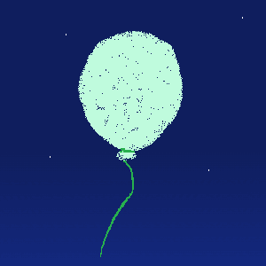
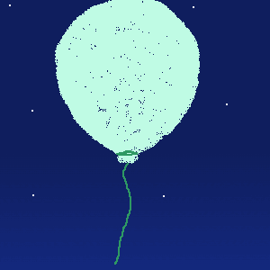
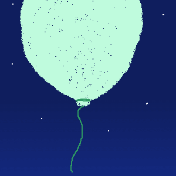
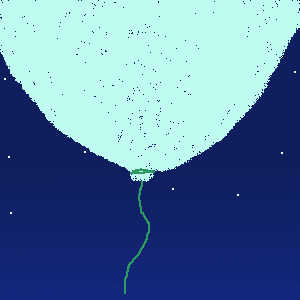

# Dynamic Balloon NFT

## Overview

The Dynamic Balloon NFT project combines the functionality of an ERC20 token named Air and a Balloon NFT. When purchasing Air tokens, a dynamic Balloon NFT is automatically minted and associated with the buyer's wallet. The Air tokens are then streamed to the wallet at a rate of 1 token per second until the full purchased amount is received. The Balloon NFT's appearance changes over time, with its color changing every second during the streaming process, and its size growing based on the number of Air tokens held.

The project aims to create a decentralized and autonomous environment where future DAO members can vote to update the NFT metadata every 30 days. Additionally, the project includes a website that showcases the NFTs side by side, creating a collage-like image.

## Features

- Purchase Air tokens and receive a dynamic Balloon NFT that changes color and grows in size.
- Stream Air tokens to your wallet at a rate of 1 token per second.
- Update your stream by purchasing more Air tokens, selling them, or transferring them to others.
- DAO governance structure allows future members to vote on new NFT metadata every 30 days.
- Collage website displays all the NFTs side by side, forming an evolving image.

## Superfluid Integration

The project leverages Superfluid, a smart contract framework that introduces the concept of Super Tokens. Super Tokens extend the functionality of basic ERC20 tokens and allow for more advanced features, such as constant flow agreements (CFAs) for streaming tokens. By integrating Superfluid, the Dynamic Balloon NFT project enables the streaming functionality of Air tokens.

For more information on Superfluid, refer to the [Superfluid Protocol Overview](https://docs.superfluid.finance/superfluid/protocol-overview/in-depth-overview).

## Getting Started

Currently, Ballooooning is waiting for Superfluid to be deployed and operating on Fantom. Once that is complete, you will be able to purchase the Air tokens just like any other token. When you purchase Air tokens, the Ballooooning NFT will automatically appear in the wallet that purchased the Air tokens.

## Challenges Faced

Creating a decentralized and autonomous project from scratch posed various challenges. Some of the key challenges encountered during the development of the Dynamic Balloon NFT project include:

1. **Implementing DAO Governance**: Establishing a robust governance structure within the project required careful consideration and integration of suitable DAO platforms. Finding the right balance between decentralization, security, and usability was a significant challenge.

2. **Enabling Voting and Decision-making**: Designing and implementing a fair and transparent voting system for NFT metadata updates involved creating smart contracts or integrating off-chain solutions. Ensuring the security and integrity of the voting process while providing an accessible user interface was a complex task.

3. **Integrating Superfluid on Fantom DAG**: Forking the Superfluid protocol to support the Fantom DAG (Directed Acyclic Graph) presented technical challenges. Adapting and modifying the protocol to be compatible with Fantom's specific architecture and consensus mechanism required careful consideration and extensive testing.

4. **Maintaining Collage Website**: Developing a website that displays the evolving NFTs as a collage required designing an intuitive user interface and implementing dynamic image generation. Ensuring the smooth integration of the NFT metadata updates with the website's functionality posed additional challenges.

Overcoming these challenges required thorough research, collaboration with the developer community, and meticulous testing to ensure a decentralized and autonomous project with a seamless user experience.

## The 5 Stages Based on Air Token Balance

The appearance of the Balloon NFT evolves based on the balance of Air tokens in your wallet. Here are the 5 stages and their corresponding Air token balances:

**Stage 0**: Balloon size and color change during the stream with each new token sent to your wallet. Balance range: 0 - 10,000 Air tokens.

**Stage 1**: Balloon size and color change during the stream with each new token sent to your wallet. Balance range: 10,000 - 20,000 Air tokens.

**Stage 2**: Balloon size and color change during the stream with each new token sent to your wallet. Balance range: 20,000 - 30,000 Air tokens.

**Stage 3**: Balloon size and color change during the stream with each new token sent to your wallet. Balance range: 30,000 - 40,000 Air tokens.

**Stage 4**: Balloon size and color change during the stream with each new token sent to your wallet. Balance range: 40,000 - 50,000 Air tokens.

## Collage of Stage 4 Balloon NFTs

As the Balloon NFT evolves through different stages based on the balance of Air tokens in your wallet, you can showcase a visually stunning collage by combining multiple Stage 4 NFTs in a 5x5 grid pattern. Each Stage 4 NFT represents a balance of 40,000 to 50,000 Air tokens.

Here's an example of what the collage of Stage 4 NFTs would look like:

